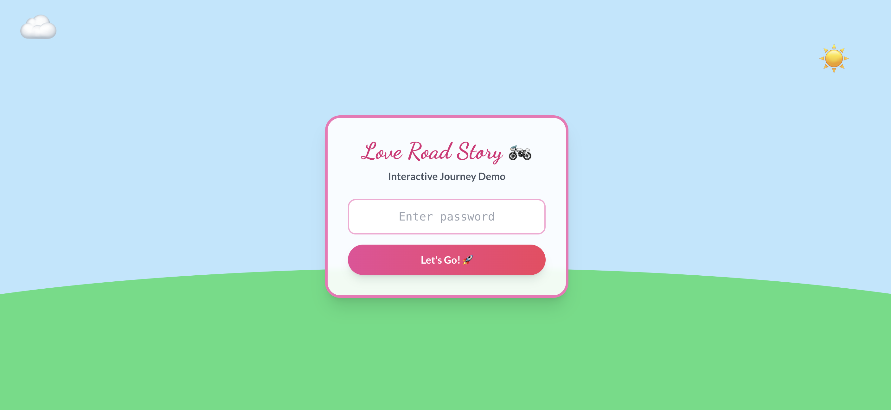

Hello mọi người, mình vừa thực hành kiến thức khóa học để build được một cái web nhỏ tặng bạn gái ngày Valentine. Sẵn tiện chia sẻ workflow thực tế và trả bài tập về nhà luôn.

Demo site: https://yoloh3.com/sites/demo_valentine/index/dist
Mật khẩu: 9999

Project tên là "Love Road Story" - một web app đơn giản mô phỏng hành trình kỷ niệm bằng timeline tương tác. Dưới đây là cách mình đi từ ý tưởng đến deploy:

-
1. Workflow thực hiện
Mình chia quy trình làm 4 bước, kết hợp nhiều công cụ AI để đẩy nhanh tốc độ:
-
Phase 1: Brainstorm ý tưởng (Claude 4.6)
Thay vì tự nghĩ nát óc, mình chat với Claude để tìm concept.
Input: "Muốn làm web tặng bạn gái, kỷ niệm các mốc thời gian, thích sự nhẹ nhàng. 2 người ngồi trên con xe (hoạt ảnh animation) chạy lên xuống qua các timeline." Cùng với đó là mẫu PRD của anh Nguyen Nhat Quang.
Output: Idea về chiếc xe máy chạy trên địa hình đồi núi (SVG), đi qua các cột mốc là ảnh kỷ niệm.
Kết quả: Có được bản PRD (yêu cầu sản phẩm) cơ bản để bắt đầu.
-
Phase 2: Dựng FE (Google AI Studio)
Dùng prompt từ PRD ném vào Google AI Studio. AI generate ra bộ khung code khá ổn, chạy được animation xe máy và timeline cơ bản ngay lập tức. Tiết kiệm được rất nhiều thời gian setup ban đầu.
Đã thử dùng Antigravity để tạo FE nhưng thất vọng :(((
-
Phase 3: Tối ưu & Refactor (Antigravity + AWF Skills) - BTVN #3
Đây là phần bài tập về nhà số 3 của mình: Dùng Antigravity để hiểu và tối ưu code AI sinh ra.
Tải codebase từ Google AI Studio về Antigravity
Kêu Caude AI hiểu codebase và đồng bộ với github site code hiện tại
Dùng AWF (Antigravity Workflow Framework) - bộ skill được ae trên nhóm share, chuyên dụng để development với Antigravity.
Cụ thể, dùng skill /brainstorming để hiểu codebase và nghĩ ý tưởng tiếp
Dùng /debug khi có các code issue
Note: Dùng Gemini Flash cho các hoạt động đơn giản (git branch, push, review code), và luôn dùng Claude Sonnet cho coding. Còn brainstorming và plannning thì dùng luôn Caude Opus 4.6 (trí tuệ giáo sư ).
-
Phase 4: Security Check - BTVN #2
Phần bài tập số 2: Đảm bảo sản phẩm "nhà làm" cũng phải an toàn.
Dù là web tĩnh (static site) nhưng mình vẫn thêm một lớp Password Gate đơn giản để hạn chế public thông tin cá nhân.
Review lại code để đảm bảo không hardcode các thông tin nhạy cảm khác trước khi push lên Github Pages.
-
2. Tổng kết nhanh
Thời gian: Khoảng 2 ngày (tranh thủ nghỉ Tết  ).
Chi phí: Đăng ký Gemini Pro giảm giá (~300k), và thêm 3 account vào family. Switching liên tục và dùng gần hết token của cả 3 account.
Kết quả: Web chạy mượt, sẵn sàng làm quà tặng bạn gái, và quan trọng là mình thực hành được quy trình kết hợp nhiều AI tool vào workflow thực tế.

